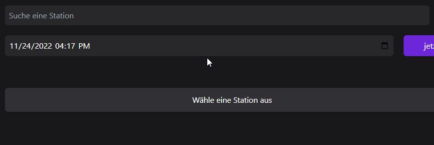
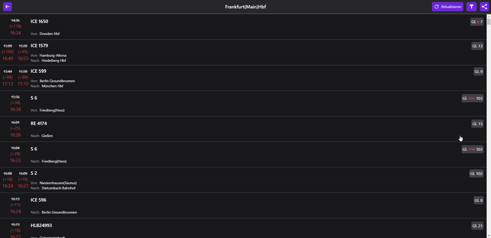
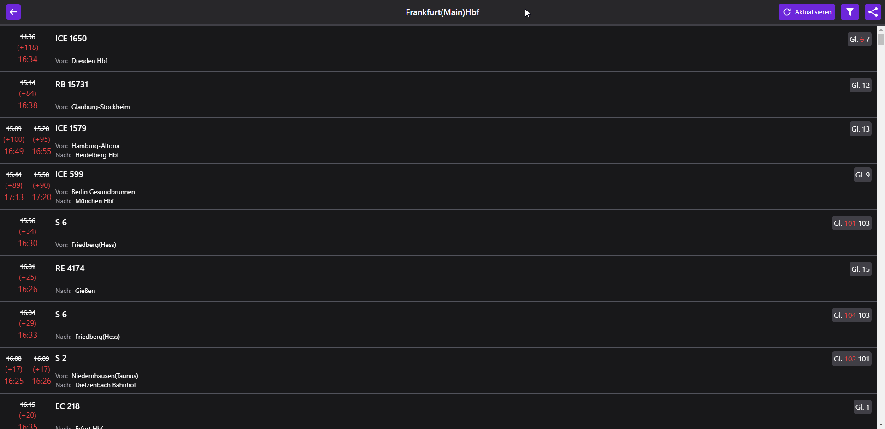
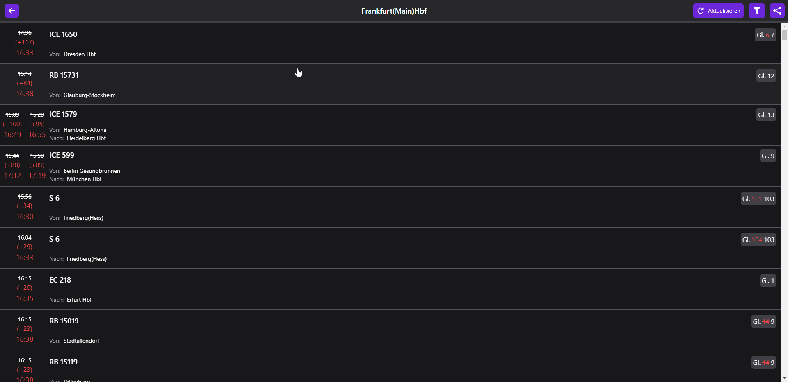

# Railboard

Railboard is a web-app to easily view information like delay, platform(-changes) and more
base upon the German Train Service's ([Deutsche Bahn](https://www.deutschebahn.com/)) API.

The Website is only available in German since the API basically only has German Train data,
I might add localization when Next.js 13 has a good way of doing that.

## Features / Demos

- Search with Favorites \

- View Station Boards with Arrival & Darture Date + their delay and show platform(-change) \

- Filter which Trains you want to see on the Station Board \

- View Journey Details of Train with important Messages \

